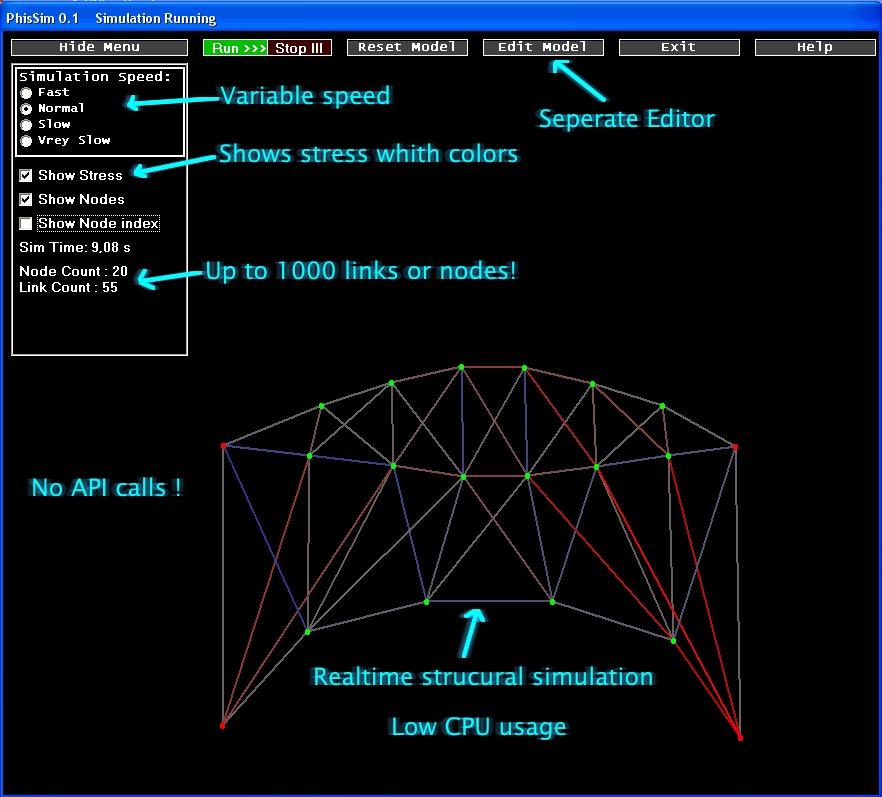



## Structural Physics Simulator \(not just a boucning ball\!\)

### Description

This is not your avrage physics sim you find on the net.It simulates wireframe structures. You can simulate a bridge in this and all sorts of other stuff! There are a few sample models whith it in the models folder.It comes whith editor to make your own models. I have hidravlic links and simalar cool stuff planed for it so then you will be able to make robots and simalar stuff in it! You wont regret downloading this! Oh and please comment and vote!
 
### More Info
 

             |
---                |---
**Submitted On**   |2006-12-11 22:21:18
**By**             |[Berni](https://github.com/Planet-Source-Code/PSCIndex/blob/master/ByAuthor/berni.md)
**Level**          |Intermediate
**User Rating**    |5.0 (65 globes from 13 users)
**Compatibility**  |VB 6\.0
**Category**       |[Miscellaneous](https://github.com/Planet-Source-Code/PSCIndex/blob/master/ByCategory/miscellaneous__1-1.md)
**World**          |[Visual Basic](https://github.com/Planet-Source-Code/PSCIndex/blob/master/ByWorld/visual-basic.md)
**Archive File**   |[Structural20376112142006\.zip](https://github.com/Planet-Source-Code/berni-structural-physics-simulator-not-just-a-boucning-ball__1-67381/archive/master.zip)

